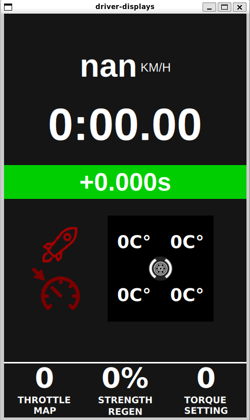

# QT Driver Displays

[](https://forthebadge.com)

[](https://forthebadge.com)
[](https://forthebadge.com)

[](https://forthebadge.com)

Driver Displays software for Redback Racing RB23.
<p align="center">

</p>
This project makes use of the Qt6 framework for GUI. The C++ backend parses CAN Data.


# Installation (Inital)
1. Clone git submodules first.
```
git submodule update --init --recursive
```
2. Run the install_dependencies.sh script in scripts/ to install pigpio and apt dependencies.

```
cd driver-displays/scripts
. install_dependencies.sh
```
(Recommended) 3. Run this script to install Qt 6.5.0 and Qt Creator to the ~/Qt Directory.

```
cd driver-displays/scripts
. install_qt.sh
```


### Troubleshooting
Make sure that Qt has installed succesfully. If a Pip error occurs you may need to reboot your computer.

# Dependencies

## Pigpio
The installation script provided in this repo installs this.
Alternatively, follow the guide on this [website](https://abyz.me.uk/rpi/pigpio/download.html) to build and install pigpio. 


## Qt 6.5.0
The installtion already script installs these dependencies.
Driver displays requires:
* Qt Core 
* QtSerialBus
* Qt5 Compat
* QtSerialPort

### Aqt Installer (Recommended Linux and WSL2)
You can use the command line tool aqt to install Qt with the required submoudles and QtCreator tool.
```
pip install aqtinstall
```
If you are on linux environment
```
aqt install-qt linux desktop 6.5.0 --modules qtserialbus qt5compat qtserialport -O ~/Qt
```
```
aqt install-tool linux desktop tools_qtcreator -O ~/Qt
```

Then make sure in your project kits in Qt Creator that the Qt 6.5.0 qmake binary is selected.


### Qt Installation Tool (2nd Recommended)
Alternatively you can use the Qt installation tool to download Qt6.5.0 and Qt Creator IDE for fully configured Qt6 development environment. It will allow one click run and build of driver-displays.

[Install Qt and QtCreator](https://redbackracing63.atlassian.net/l/cp/Emm4uPXm)


### From Source (Advanced)
Refer to the following Confluence document on how to set build Qt6 from source
for compilation in via the CLI.

[How to Build Qt6 and Build driver-displays](https://redbackracing63.atlassian.net/l/cp/jmtFgbaZ)


# Build and Run
## Qt Creator
If you installed Qt with the Qt Installation tool then this is pre-configured. Otherwise you must follow these steps.

### Setup
Qt Creator requires the Qt 6.5.0 qmake binary.
1. Clone driver-displays repo
2. Load the project in Qt Creator by opening the CMakeLists.txt file in the root directory of the repo.
3. Go the projects side-tab, 
4. Manage kits
5. Add Qt Version
6. Locate the qmake binary in ~/Qt/6.5.0/gcc_64/bin/qmake


7. You may need to reconfigure with inital parameters after you relocate Qt and Cmake if the driver displays still doesn't build properly.


### Run
You can run the driver-displays software from within the Qt Creator IDE with the run button. Provided the project is loaded. Open the project by clicking on the CMakeLists.txt file in the project root directory.


## Ubuntu Desktop CLI

### Build
You should build with qt-cmake. Then use cmake to build and install.
```
~/Qt/6.5.0/gcc_64/bin/qt-cmake -B ddPiBuild .
cd ddPiBuild
cmake --build . --parallel $(nproc)
cmake --install .
```

### Run
You can run the driver displays from the command line like this.

```
cd ddPiBuild
./driver-displays
```

Refer to the [confluence document](https://redbackracing63.atlassian.net/wiki/spaces/DA/pages/2427290730/Cross+Compiling+Qt6+x86+Host+to+ARMv8+Raspberry+Pi+3+4#6.-Launch-driver-displays) for detailed running instructions on Raspberry Pi.

## Ubuntu Server CLI Raspberry Pi

You may need to export environment variables and run some commands before running driver-displays on the Raspberry Pi 4.
Run these export commands, or include it in the .bashrc file:

```
export LD_LIBRARY_PATH=$LD_LIBRARY_PATH:/usr/local/qt6/lib/
export QT_QPA_PLATFORM=linuxfb:tty=/dev/fb0
```

Fix user permissions for linuxfb if running from root (such as in Ubuntu Server):

```
sudo adduser <username> video
```

Depending on which renderer you want to use, you can specify the platform. Currently, only linuxfb is confirmed to work on the Raspberry Pi 4 for the current configuration.

```
./driver-displays --platform linuxfb
```

# About driver displays

The software is designed to run on Aaarch64 Ubuntu Server 20.4 on a Raspberry Pi 4. It is cross-compiled on an x86-64 Ubuntu 20.04 Machine.
The Bitbucket Pipelines runner pulls a docker image of a cross-compiled Qt 6.5.0 ARM installation and uses it to compile the driver-displays binary.

The GUI is intended to run at 800x480 in resolution, with a 90 degree display rotation. The UI is technically dynamically scalable but might need adjustments.
It is built for the Riverdi RVT50HQTFWN00 5 inch display.

# Testing

## Testing Values

### Socket CAN Utils
Use the cansend command to manually send LittleEndian values to driver displays via vcan0 or your specified interface. 

Each sensor is defined in the dbc files. The connect value should be set to true.

Example: 16 bit Little Endian Signed int to change WheelTempRR8
```
./scripts/virtual_can_setup.sh
cansend 709#0000000000000100
```


### Can-Cli (Not Working Yet)
Currently broken, does not send the right values based on dbc file.
```
./scripts/virtual_can_setup.sh
cd test/emulators
python3 can_cli.py SensorBus.dbc vcan0
```


## Unit Tests (Not Yet Implemented)

# Troubleshooting

## Driver displays won't open

Sometimes when you build and run the driver displays it may not open. This is because the configuration file may have

```
connect: true
```

This means the software is looking for the CAN socket to connect. You may notice the terminal saying:

```
Creating Backend Object
```

To fix this, either connect the CAN socket with the python emulator or set the config to false.

# Contribution

All new features should be on a different branch to develop.

The conditions of acceptance for a new feature are:

- Feature should be made ready for merge via pull request
- Needs 2+ total approvals before merge
- Needs to pass Continous Integration checks via Bitbucket pipelines
- The purpose of change has to be established in description
- C++ code should follow the [C++ Style Guide](https://google.github.io/styleguide/cppguide.html). Tab indenting and K&R brace placement
- Qml should follow the [Qml Coding Conventions](https://doc-snapshots.qt.io/qt6-dev/qml-codingconventions.html)

# I need more help

Contact Shady Alwidyan (z5312611) for more information about driver displays.
# HUD-Driver-Display
